# Ultra Fitness Gym Management System
## Complete Technical Documentation & Walkthrough

**Version:** 6.1  
**Date:** December 2025  
**Author:** System Documentation

---

## 📋 Table of Contents

1. [System Overview](#system-overview)
2. [Architecture Diagrams](#architecture-diagrams)
3. [User Flows](#user-flows)
4. [Admin Portal Features](#admin-portal-features)
5. [Member Portal Features](#member-portal-features)
6. [Backend API Documentation](#backend-api-documentation)
7. [Database Schema](#database-schema)
8. [Deployment Guide](#deployment-guide)
9. [Feature Reference](#feature-reference)

---

## 1. System Overview

### 1.1 Introduction

Ultra Fitness Gym Management System is a full-stack web application designed to manage gym operations, including:

- **Customer Management** - Member profiles, photos, and plans
- **Attendance Tracking** - QR code-based check-in system
- **Payment Management** - Transaction history and plan renewals
- **Member Portal** - Self-service portal for members
- **Analytics Dashboard** - Business insights and reporting
- **Email Notifications** - Automated expiry reminders

### 1.2 Technology Stack


**Tech Stack Details:**
- **Frontend:** Vanilla JavaScript, HTML5, CSS3
- **Backend:** Node.js, Express.js
- **Database:** MongoDB with Mongoose ODM
- **Authentication:** JWT (JSON Web Tokens)
- **File Storage:** Cloudinary
- **Hosting:** Render.com
- **Email:** EmailJS
- **PWA:** Service Workers, Web App Manifest

---

## 2. Architecture Diagrams

### 2.1 System Architecture


### 2.2 Data Flow Architecture


### 2.3 Authentication Flow


---

## 3. User Flows

### 3.1 Admin Login & Customer Management Flow


### 3.2 Member Portal Flow


### 3.3 QR Code Attendance Flow


### 3.4 Payment Processing Flow


---

## 4. Admin Portal Features

### 4.1 Dashboard Overview

**Main Components:**


**Key Features:**
- **Real-time Statistics**: Live count of customers by status
- **Search**: Filter by name, email, phone
- **Status Filters**: All, Active, Expiring, Expired
- **Sort Options**: Name, Date, Plan
- **Responsive Grid**: Adapts to screen size

### 4.2 Customer Card Layout

Each customer card displays:
- Profile photo (or placeholder)
- Name and Member ID
- Age, Email, Phone
- Plan type
- Validity date and status badge
- Days remaining countdown
- Action buttons (Edit, Pay, Delete, QR)

**Status Color Coding:**
- 🟢 **Green**: Active (>7 days remaining)
- 🟡 **Yellow**: Expiring (1-7 days)
- 🔴 **Red**: Expired (0 days)

### 4.3 Customer Management

**Add/Edit Customer Form:**


### 4.4 QR Code Scanner

**Scanner Workflow:**
1. Admin clicks "Scan QR" button
2. Camera permission requested
3. Scanner continuously reads QR codes
4. When QR detected:
   - Parse customer ID
   - Check membership status
   - Mark attendance
   - Play beep (short for active, long for expired)
   - Show success modal
   - Scanner keeps running for next scan

### 4.5 Payment Management

**Payment Features:**
- Record new payments
- View payment history table
- Automatic validity calculation
- Real-time customer card update
- Export to Excel

**Payment Form Fields:**
- Customer selection
- Amount
- Plan type
- Payment date
- Notes

---

## 5. Member Portal Features

### 5.1 Portal Architecture


### 5.2 Member Dashboard Components

**Quick Actions Grid:**
```
┌──────────────┬──────────────┐
│   📱 My QR   │  📅 Attendance│
├──────────────┼──────────────┤
│ ⚖️ BMI Calc  │   💳 Payments │
├──────────────┼──────────────┤
│  ⚙️ Settings │              │
└──────────────┴──────────────┘
```

**Dashboard Elements:**
- Member avatar (photo from admin)
- Member name and ID
- Plan type badge
- Days remaining countdown
- Expiry date
- Status badge (Active/Expiring/Expired)
- Quick action buttons

### 5.3 BMI Calculator

**Calculator Features:**

```mermaid
flowchart LR
    Start[BMI Calculator] --> Unit{Select Unit}
    Unit -->|Metric| Metric[Height cm, Weight kg]
    Unit -->|Imperial| Imperial[Feet, Inches, lbs]
    
    Metric --> Calc[Calculate BMI]
    Imperial --> Convert[Convert to Metric] --> Calc
    
    Calc --> Result[BMI Value]
    Result --> Category{Category}
    
    Category -->|<18.5| Under[Underweight - Blue]
    Category -->|18.5-24.9| Normal[Normal - Green]
    Category -->|25-29.9| Over[Overweight - Yellow]
    Category -->|≥30| Obese[Obese - Red]
    
    Under --> Tips1[Health Tips]
    Normal --> Tips2[Maintenance Tips]
    Over --> Tips3[Exercise Tips]
    Obese --> Tips4[Consult Doctor]
```


**Visual Indicator:**
- Color-coded scale (Blue/Green/Yellow/Red)
- Animated pointer showing BMI position
- Category label with range
- Personalized health tips

### 5.4 Profile Management

**Read-Only Fields:**
- Profile photo (set by admin only)
- Member ID

**Editable Fields:**
- Name
- Email
- Phone

**Security Features:**
- Password change form
- Current password verification
- First-login forced password change
- Logout functionality

---

## 6. Backend API Documentation

### 6.1 API Endpoints Overview

```mermaid
graph TB
    API[REST API Server] --> Auth[/api/auth]
    API --> Customer[/api/customers]
    API --> Member[/api/member]
    API --> Attendance[/api/attendance]
    API --> Payment[/api/payments]
    API --> Upload[/api/upload]
    API --> Analytics[/api/analytics]
    
    Auth --> Login[POST /login]
    
    Customer --> GetAll[GET /]
    Customer --> GetOne[GET /:id]
    Customer --> Create[POST /]
    Customer --> Update[PUT /:id]
    Customer --> Del[DELETE /:id]
    
    Member --> MLogin[POST /login]
    Member --> Profile[GET /me]
    Member --> UpdateProf[PUT /profile]
    Member --> ChangePwd[PUT /change-password]
    Member --> MAtt[GET /attendance]
    Member --> MPay[GET /payments]
    
    Attendance --> Mark[POST /mark]
    Attendance --> GetAtt[GET /]
    
    Payment --> Record[POST /]
    Payment --> GetPay[GET /]
    
    Upload --> Photo[POST /photo]
    
    Analytics --> Stats[GET /stats]
```

### 6.2 Authentication Endpoints

**Admin Login**
```
POST /api/auth/login
Body: { email, password }
Response: { token, user }
```

**Member Login**
```
POST /api/member/login
Body: { memberId, password }
Response: { token, customer, isFirstLogin }
```

### 6.3 Customer Management Endpoints

**Get All Customers**
```
GET /api/customers
Query: ?search=&status=&plan=&page=1&limit=20
Response: { customers[], pagination }
```

**Create Customer**
```
POST /api/customers
Headers: Authorization: Bearer <token>
Body: {
  name, email, phone, age, plan, 
  validity, photo, notes
}
Response: { customer }
```

**Update Customer**
```
PUT /api/customers/:id
Body: { name, email, phone, ... }
Response: { customer }
```

**Delete Customer**
```
DELETE /api/customers/:id
Response: { message }
```

### 6.4 Attendance Endpoints

**Mark Attendance**
```
POST /api/attendance/mark
Body: { customerId }
Response: { attendance, alreadyMarked }
```

**Get Attendance Records**
```
GET /api/attendance
Query: ?date=YYYY-MM-DD&limit=30
Response: { attendance[] }
```

### 6.5 Payment Endpoints

**Record Payment**
```
POST /api/payments
Body: {
  customerId, amount, plan, 
  paymentDate, notes
}
Response: { payment, updatedCustomer }
```

**Get Payments**
```
GET /api/payments
Query: ?customerId=&limit=10&page=1
Response: { payments[], pagination }
```

---

## 7. Database Schema

### 7.1 Collections Overview


### 7.2 Customer Schema

**Fields:**
- `_id`: MongoDB ObjectId (auto-generated)
- `name`: String, required
- `email`: String, required, unique
- `phone`: String, required
- `age`: Number, required
- `plan`: Enum ['Monthly', 'Quarterly', 'Yearly']
- `validity`: Date, required
- `photo`: String (Cloudinary URL)
- `notes`: String (optional)
- `memberId`: String, unique (format: U001, U002...)
- `password`: String, hashed (bcrypt)
- `isFirstLogin`: Boolean, default true
- `lastLogin`: Date
- `createdAt`: Date (auto-generated)

**Indexes:**
- email (unique)
- memberId (unique)
- validity (for expiry queries)

**Virtual Fields:**
- `daysRemaining`: Calculated from validity
- `status`: Calculated (active/expiring/expired)

### 7.3 Attendance Schema

**Fields:**
- `customerId`: ObjectId, ref 'Customer'
- `customerName`: String
- `timestamp`: Date (exact check-in time)
- `date`: String (YYYY-MM-DD)
- `time`: String (HH:MM AM/PM)
- `membershipStatus`: String (active/expiring/expired)

**Indexes:**
- customerId + date (compound, unique) - prevents duplicate check-ins
- date (for daily queries)

### 7.4 Payment Schema

**Fields:**
- `customerId`: ObjectId, ref 'Customer'
- `customerName`: String
- `amount`: Number, required
- `plan`: String
- `paymentDate`: Date
- `notes`: String
- `status`: Enum ['completed', 'pending']

**Indexes:**
- customerId (for customer payment history)
- paymentDate (for reporting)

---

## 8. Deployment Guide

### 8.1 Deployment Architecture


### 8.2 Environment Variables

**Required Variables:**
```bash
# Database
MONGODB_URI=mongodb+srv://...

# JWT
JWT_SECRET=your-secret-key

# Cloudinary
CLOUDINARY_CLOUD_NAME=your-cloud-name
CLOUDINARY_API_KEY=your-api-key
CLOUDINARY_API_SECRET=your-api-secret

# Server
PORT=5000
NODE_ENV=production
```

### 8.3 Deployment Steps

**1. MongoDB Atlas Setup**


**2. Cloudinary Setup**
- Create account at cloudinary.com
- Get API credentials from dashboard
- Add to environment variables

**3. Render Deployment**


**Build Command:** `npm install`  
**Start Command:** `npm start`  
**Root Directory:** `ultra-fitness-backend`

### 8.4 Frontend Deployment

**Static Files Location:**
- Admin Portal: `/ultra-fitness-backend/public/`
- Member Portal: `/ultra-fitness-backend/public/member-app/`

**API Configuration:**
Update `API_CONFIG.BASE_URL` in both:
- `public/api.js` (Admin)
- `public/member-app/api.js` (Member)

```javascript
const API_CONFIG = {
    BASE_URL: 'https://your-app.onrender.com'
};
```

---

## 9. Feature Reference

### 9.1 Authentication

**Admin Authentication:**
- Email + Password
- JWT token stored in sessionStorage
- Token expiry: 7 days
- Auto-logout on expiry

**Member Authentication:**
- Member ID + Password
- JWT token stored in sessionStorage
- First-login password change required
- Password hashing with bcrypt

### 9.2 Customer Management

**Features:**
- ✅ Add new customers
- ✅ Edit customer details
- ✅ Delete customers (with confirmation)
- ✅ Upload profile photos
- ✅ Take live camera photos
- ✅ Search and filter
- ✅ Sort by various fields
- ✅ Export to Excel
- ✅ Auto-generate Member IDs (U001, U002...)
- ✅ Auto-generate temporary passwords
- ✅ Display password on first creation

### 9.3 Attendance System

**QR Code Features:**
- ✅ Generate unique QR per customer
- ✅ Display in member portal
- ✅ Download as PNG
- ✅ Scan with admin portal
- ✅ Continuous scanning mode
- ✅ Prevent duplicate check-ins (1 per day)
- ✅ Audio feedback (beeps)
- ✅ Voice alerts for expired members
- ✅ Visual success modals
- ✅ Real-time attendance dashboard

**Attendance Tracking:**
- Daily check-in records
- Timestamp precision
- Membership status capture
- Export to Excel
- Filter by date

### 9.4 Payment Management

**Features:**
- ✅ Record payments
- ✅ Auto-calculate validity extension
- ✅ Plan-based validity (30/90/365 days)
- ✅ Real-time customer card update
- ✅ Payment history view
- ✅ Export to Excel
- ✅ Payment status tracking

**Payment Flow:**
1. Select customer
2. Enter amount and plan
3. System calculates new validity date
4. Save payment record
5. Update customer validity
6. Refresh dashboard instantly

### 9.5 Member Portal

**Core Features:**
- ✅ PWA (installable app)
- ✅ Offline support
- ✅ Service worker caching
- ✅ Personal QR code display
- ✅ Attendance history
- ✅ Payment history
- ✅ BMI calculator
- ✅ Profile management
- ✅ Password change
- ✅ Responsive design

**BMI Calculator:**
- Metric and Imperial units
- Real-time calculation
- Visual color-coded scale
- Animated pointer
- Category classification
- Personalized health tips
- Educational information

### 9.6 Analytics & Reporting

**Dashboard Statistics:**
- Total customers count
- Active plans count
- Expiring soon count (≤7 days)
- Expired plans count
- Real-time updates

**Export Capabilities:**
- Customer data to Excel
- Attendance records to Excel
- Payment history to Excel
- Configurable date ranges

### 9.7 Notification System

**Email Notifications:**
- Automated expiry reminders
- EmailJS integration
- Bulk notification to expired members
- Template: Member name, plan, expiry date
- One-click send from admin portal

**In-App Notifications:**
- Bell icon notification center
- Real-time notification badge
- Notification history
- Clear all functionality

### 9.8 UI/UX Features

**Design:**
- Dark mode by default
- Glassmorphism effects
- Smooth animations
- Gradient backgrounds
- Card-based layouts
- Responsive grid
- Mobile-first approach

**Interactions:**
- Hover effects
- Loading states
- Success/Error messages
- Confirmation modals
- Skeleton loaders
- Smooth transitions

**Animations:**
- Page load fade-in
- Card hover elevation
- Button press effects
- Modal slide-in
- BMI pointer animation
- Staggered list animations

---

## 10. Technical Implementation Details

### 10.1 File Structure

```
ultra-fitness-gym/
├── ultra-fitness-backend/
│   ├── src/
│   │   ├── config/
│   │   │   ├── database.js
│   │   │   └── cloudinary.js
│   │   ├── models/
│   │   │   ├── Customer.js
│   │   │   ├── Attendance.js
│   │   │   ├── Payment.js
│   │   │   └── User.js
│   │   ├── controllers/
│   │   │   ├── authController.js
│   │   │   ├── customerController.js
│   │   │   ├── memberController.js
│   │   │   ├── attendanceController.js
│   │   │   └── paymentController.js
│   │   ├── routes/
│   │   │   ├── auth.routes.js
│   │   │   ├── customer.routes.js
│   │   │   ├── member.routes.js
│   │   │   ├── attendance.routes.js
│   │   │   └── payment.routes.js
│   │   ├── middleware/
│   │   │   ├── auth.js
│   │   │   └── errorHandler.js
│   │   └── utils/
│   │       ├── jwt.js
│   │       └── validation.js
│   ├── public/
│   │   ├── index.html (Admin Portal)
│   │   ├── app.js
│   │   ├── api.js
│   │   ├── styles.css
│   │   └── member-app/
│   │       ├── index.html (Login)
│   │       ├── dashboard.html
│   │       ├── qr-code.html
│   │       ├── attendance.html
│   │       ├── payments.html
│   │       ├── bmi-calculator.html
│   │       ├── profile.html
│   │       ├── app.js
│   │       ├── api.js
│   │       ├── styles.css
│   │       ├── service-worker.js
│   │       └── manifest.json
│   ├── server.js
│   ├── package.json
│   └── .env
└── README.md
```

### 10.2 Security Measures

**Authentication:**
- Password hashing with bcrypt (10 rounds)
- JWT with 7-day expiry
- Token verification middleware
- Session management

**Authorization:**
- Role-based access (Admin/Member)
- Protected routes
- Middleware checks
- Token validation

**Data Protection:**
- MongoDB injection prevention
- Input sanitization
- CORS configuration
- Environment variable security

### 10.3 Performance Optimizations

**Frontend:**
- Service worker caching (PWA)
- Lazy loading
- Image optimization (Cloudinary)
- Minified assets
- Compressed responses

**Backend:**
- MongoDB indexing
- Query optimization
- Pagination
- Efficient aggregations
- Connection pooling

**Caching Strategy:**
- Static assets: Long-term cache
- API responses: No cache
- Images: CDN caching
- Service worker: Version-based cache

---

## 11. Troubleshooting Guide

### 11.1 Common Issues

**Issue: Service Worker Not Updating**
```
Solution:
1. Bump CACHE_NAME version in service-worker.js
2. Add cache-control meta tags
3. Clear browser cache manually
4. Use Incognito mode to test
```

**Issue: Photo Upload Fails**
```
Check:
1. Cloudinary credentials in .env
2. File size (max 5MB)
3. File type (image/jpeg, image/png)
4. Internet connection
```

**Issue: QR Scanner Not Working**
```
Check:
1. Camera permissions granted
2. HTTPS connection (required for camera
3. Browser compatibility
4. Scanner library loaded
```

**Issue: Email Notifications Not Sending**
```
Check:
1. EmailJS Service ID correct
2. EmailJS Template ID correct
3. EmailJS Public Key correct
4. Customer has valid email
```

### 11.2 Browser Console Debugging

**Enable Debug Mode:**
```javascript
localStorage.setItem('debug', 'true');
// Reload page
```

**View Service Worker:**
```
Chrome DevTools → Application → Service Workers
Check status, update, and unregister
```

**View Cache:**
```
Chrome DevTools → Application → Cache Storage
Check ultra-fitness-member-vX
```

---

## 12. API Testing Examples

### Using cURL

**Admin Login:**
```bash
curl -X POST https://your-app.onrender.com/api/auth/login \
  -H "Content-Type: application/json" \
  -d '{"email":"admin@ultrafitness.com","password":"0000"}'
```

**Get Customers:**
```bash
curl https://your-app.onrender.com/api/customers \
  -H "Authorization: Bearer YOUR_TOKEN"
```

**Mark Attendance:**
```bash
curl -X POST https://your-app.onrender.com/api/attendance/mark \
  -H "Content-Type: application/json" \
  -H "Authorization: Bearer YOUR_TOKEN" \
  -d '{"customerId":"CUSTOMER_ID"}'
```

---

## 13. Future Enhancements

### Planned Features

1. **SMS Notifications**
   - Twilio integration
   - Expiry reminders via SMS
   - Payment confirmations

2. **Advanced Analytics**
   - Revenue tracking
   - Attendance trends
   - Member retention metrics
   - Graphical reports

3. **Multi-branch Support**
   - Branch management
   - Cross-branch reporting
   - Transfer members

4. **Workout Tracking**
   - Exercise logs
   - Progress photos
   - Performance metrics

5. **Mobile Apps**
   - Native iOS app
   - Native Android app
   - Push notifications

---

## 14. Conclusion

The Ultra Fitness Gym Management System provides a comprehensive solution for managing gym operations with:

✅ **Complete Customer Management**  
✅ **Automated Attendance Tracking**  
✅ **Integrated Payment System**  
✅ **Self-Service Member Portal**  
✅ **Real-Time Analytics**  
✅ **Cloud-Based Architecture**  
✅ **Mobile-Responsive Design**  
✅ **Offline PWA Support**  

The system is production-ready, scalable, and continuously maintained with regular updates and improvements.

---

## 15. Contact & Support

**System Information:**
- Version: 6.1
- Last Updated: December 2025
- Platform: Web & PWA
- Hosting: Render.com
- Database: MongoDB Atlas

**For Technical Support:**
- Check console for error logs
- Review this documentation
- Test in Incognito mode
- Clear browser cache
- Verify environment variables

---

**End of Documentation**

*This document provides complete technical coverage of the Ultra Fitness Gym Management System. For the most up-to-date information, always refer to the latest codebase.*
